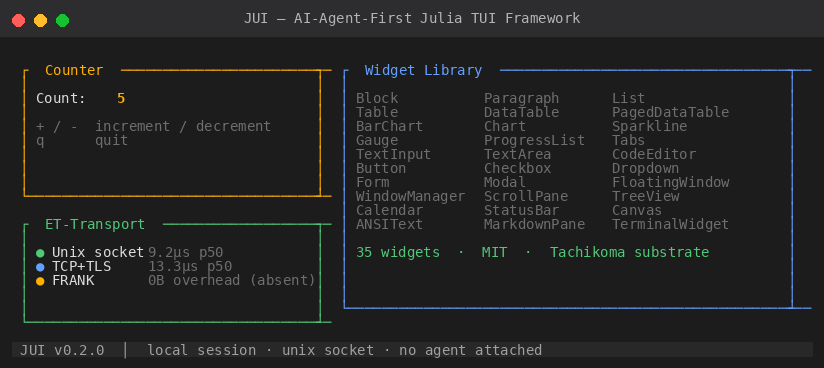
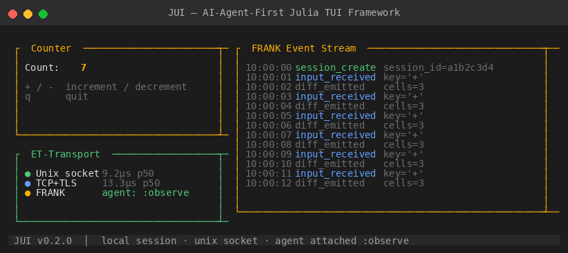

# JUI — AI-Agent-First Julia TUI Framework

JUI is a Julia TUI framework built for applications that want first-class
AI-agent introspection and remote terminal session persistence.

It is a hard fork of [Tachikoma.jl](https://github.com/kahliburke/Tachikoma.jl)
(MIT, Kahli Burke). The full Tachikoma rendering substrate — cell-grid diff,
layout solver, 30+ widgets, constraint layouts, animations, Kitty/sixel
graphics, recording/export, TestBackend — is preserved. JUI adds:

- **FRANK** — optional DevTools-like protocol for agent introspection
- **ET-Transport** — always-on Unix socket + TCP+TLS, session persistence
  and reconnect over the wire (EternalTerminal / mosh-style)
- **Agent attach API** — subscribe to live session events; `:observe` or
  `:interact` (capability-gated synthetic input)
- **Deny-by-default auth** — Unix peer UID + TLS 1.3 + bearer token + SPKI
  TOFU pinning

Think of it as: a rich TUI framework that an AI agent can attach to,
inspect, drive, and debug — across a network boundary if needed.

<p align="center">
  
</p>
<p align="center">
  
</p>

## At a glance

- **5856 tests** passing (2 pre-existing env-dependent kitty graphics probes)
- **9.2 µs** p50 round-trip latency on Unix socket transport
  (0.69× vs raw TCP loopback — Unix socket is faster)
- **Zero overhead** when FRANK is absent (`@inline` no-op hooks, 0 bytes
  allocated on hot path)
- **MIT License**

## Install and Test Yourself

### Prerequisites

1. **Julia 1.10+**

### Install

```julia
using Pkg

# General registry supplies transitive deps (JSON3, StructTypes, etc.)
Pkg.Registry.add("General")

# SuperSeriousLab registry supplies JUI + FRANK
Pkg.Registry.add(Pkg.RegistrySpec(
    url = "https://github.com/SuperSeriousLab/JuliaRegistry.git"
))

# FRANK is an optional weak dep — add it to enable diagnostics
Pkg.add(["JUI", "FRANK"])
```

### Verify your install

```julia
julia -e "using JUI; println(\"JUI $(pkgversion(JUI)) loaded OK\")"
```

### Run the test suite (optional)

```bash
git clone https://github.com/SuperSeriousLab/JUI && cd JUI
julia --project=. -e "using Pkg; Pkg.test()"
```

Expected: 5856 passed. Two `_kitty_shm_probe!` tests require a
Kitty-capable terminal and are skipped in standard environments.

## Minimal app

```julia
using JUI

mutable struct Counter <: JUI.Model
    n::Int
    quit::Bool
end

JUI.should_quit(c::Counter) = c.quit

function JUI.view(c::Counter, frame::JUI.Frame)
    JUI.render(JUI.Block(title = "Counter — +/- / q"), frame.area, frame.buffer)
    JUI.set_string!(frame.buffer, 2, 2, "Count: $(c.n)")
end

function JUI.update!(c::Counter, evt::JUI.Event)
    if evt isa JUI.KeyEvent
        evt.char == '+' && (c.n += 1)
        evt.char == '-' && (c.n -= 1)
        evt.char == 'q' && (c.quit = true)
    end
end

JUI.app(Counter(0, false))
```

## Agent-attachable session

Run the same app over an ET-transport session that an AI agent can attach
to:

```julia
using JUI, FRANK

# Server side — automatically generates cert + token, opens Unix socket
session = run_et!(Counter(0, false))  # returns when app exits

# From another Julia process (or another host via TCP), an agent
# subscribes to the session event stream:
sid = attach_agent(session.id, function(event)
    @info "agent observed" event
end; mode = :observe)

# Interactive agent (capability-gated) can inject synthetic input:
sid2 = attach_agent(session.id, function(_) end; mode = :interact)
inject_input(sid2, KeyEvent('+'))

detach_agent!(sid)
detach_agent!(sid2)
```

For remote TCP sessions with TLS + bearer token + SPKI TOFU, see
[`docs/quickstart.md`](docs/quickstart.md#remote-tcp-session).

## Architecture

```
                         Application
                              │
                   ┌──────────┴──────────┐
                   │      JUI.app()      │
                   └──────────┬──────────┘
                              │
        ┌─────────────────────┼─────────────────────┐
        │                     │                     │
   Tachikoma substrate        │             JUI additions
        │                     │                     │
  ┌─────┴─────┐       ┌───────┴───────┐     ┌───────┴────────┐
  │ Cell grid │       │  TaskQueue    │     │ FRANK hooks    │
  │ Layout    │       │  Event loop   │     │  (weak dep)    │
  │ 30+ widgets│──────│               │─────│ AppState serde │
  │ Animation │       │  TestBackend  │     │ ET-Transport   │
  │ Kitty/sixel       │               │     │ Auth + SPKI    │
  └───────────┘       └───────────────┘     │ Agent attach   │
   MIT, preserved     MIT, preserved         └────────────────┘
                                               MIT, new
```

## Wire Protocol (ET-Transport)

Server-authoritative. Widgets live server-side only. Client = dumb cell
renderer + keystroke pipe.

- **Down (server → client)**: `snapshot_message` on attach, `diff_message`
  thereafter (cell-level diff of Buffer)
- **Up (client → server)**: `input_message` wrapping `KeyEvent`,
  `MouseEvent`, or `Resize`

All messages are newline-delimited JSON via `JSON3.StructType`. Full spec
in [`docs/wire-protocol.md`](docs/wire-protocol.md).

## Remote access — `ssj`

`ssj` is the included client command. It SSH-fetches a bearer token once,
caches it, then connects via TCP+TLS:

```bash
# Linux/macOS (bin/ssj — add to PATH)
ssj user@myserver.example.com

# Windows PowerShell (bin/ssj.ps1)
.\ssj.ps1 user@myserver.example.com

# Custom port
ssj myserver.example.com:9000

# Force token refresh
ssj myserver.example.com --refresh
```

On first connect, `ssj` runs `ssh user@host cat ~/.config/jui/token` and
caches the result locally. Subsequent connects use the cache — no SSH needed.

## Auth model

- **Unix socket** — `chmod 0600` + peer UID check (`SO_PEERCRED`/`getpeereid`).
  Socket at `$XDG_RUNTIME_DIR/jui/$SESSION.sock`.
- **TCP** — TLS 1.3 (self-signed cert, SPKI TOFU pin) + session-bound
  bearer token. Deny-by-default: server refuses to bind without cert+token.
- **Agent attach** — `:observe` (read-only) or `:interact` (enables `inject_input`).

Full threat model: [`docs/phase-3-auth-design.md`](docs/phase-3-auth-design.md).

## Widget Library

35 built-in widgets inherited from the Tachikoma substrate:

| Widget | Description |
|--------|-------------|
| `Block` | Bordered container with optional title |
| `Paragraph` | Scrollable text with word-wrap |
| `List` | Selectable item list |
| `Table` | Multi-column data table |
| `DataTable` | Sortable/filterable data table |
| `PagedDataTable` | Paginated data table |
| `BarChart` | Horizontal/vertical bar chart |
| `Chart` | Line/area chart |
| `Sparkline` | Inline mini chart |
| `Gauge` | Progress gauge with label |
| `ProgressList` | List with per-item progress bars |
| `Tabs` | Tab bar navigation |
| `TextInput` | Single-line text input |
| `TextArea` | Multi-line text editor |
| `CodeEditor` | Syntax-highlighted code editor |
| `Button` | Clickable button |
| `Checkbox` | Toggle checkbox |
| `Dropdown` | Select/dropdown menu |
| `Form` | Composite form layout |
| `Modal` | Overlay modal dialog |
| `FloatingWindow` | Draggable floating panel |
| `WindowManager` | Multi-window tiling manager |
| `ScrollPane` | Scrollable container |
| `Scrollbar` | Standalone scrollbar |
| `Separator` | Horizontal/vertical divider |
| `StatusBar` | Bottom status line |
| `BigText` | Large ASCII-art text |
| `Canvas` | Free-draw pixel canvas |
| `BlockCanvas` | Block-element canvas |
| `ANSIText` | Raw ANSI escape sequence renderer |
| `MarkdownPane` | Rendered Markdown viewer |
| `TreeView` | Collapsible tree |
| `Calendar` | Month calendar |
| `TerminalWidget` | Embedded terminal emulator |
| `REPLWidget` | Embedded Julia REPL |

## Performance

Measured on a single host (`bench/local_overhead.jl`, 1000 round-trips,
128-byte payload, Linux 6.8):

| Transport | p50 | p95 | p99 |
|-----------|-----|-----|-----|
| Unix socket (JUI) | 9.2 µs | 9.6 µs | 13.3 µs |
| TCP loopback (raw) | 13.3 µs | 13.7 µs | 18.0 µs |

Unix transport is faster than raw TCP on loopback (skips TCP stack
entirely). Well below the 2× overhead budget.

## Fork History + License

JUI is a **hard fork** of Tachikoma.jl @ `2271069`, forked 2026-04-17.
MIT License © 2026 Super Serious Studios.

Tachikoma.jl is © Kahli Burke (MIT). All files originating from Tachikoma
retain their original MIT copyright headers. Full attribution in `NOTICE`.

## Documentation

| Doc | Subject |
|-----|---------|
| [`docs/quickstart.md`](docs/quickstart.md) | Install + minimal app + FRANK + remote TCP |
| [`docs/wire-protocol.md`](docs/wire-protocol.md) | Snapshot/diff/input message shapes |
| [`docs/frank-integration.md`](docs/frank-integration.md) | FRANK event schema, subscriber API |
| [`docs/phase-3-auth-design.md`](docs/phase-3-auth-design.md) | Threat model + auth decisions |
| [`CHANGELOG.md`](CHANGELOG.md) | Full v0.2.0 feature list |
| [`NOTICE`](NOTICE) | Fork attribution + licensing |

## Related

- [FRANK](https://github.com/SuperSeriousLab/FRANK) — the diagnostic protocol
  used by JUI's agent attach API. Standalone, separately versioned.
- [Tachikoma.jl](https://github.com/kahliburke/Tachikoma.jl) — the upstream
  framework this fork is based on.

## Contributing

Open issues and pull requests on [GitHub](https://github.com/SuperSeriousLab/JUI).
The test suite is expected to pass (except the 2 env-dependent kitty_shm probes)
before any merge.
